# Microservices Architecture

This repository contains a set of **Spring Boot microservices**, fully Dockerized, using **Eureka Service Discovery**, **API Gateway**, **Kafka** for event-driven communication, and **Zipkin** for distributed tracing. Each service exposes API documentation using **Swagger**. Kubernetes manifests will be added under the `infrastructure/` directory. Prometheus and Grafana for monitoring are planned to be integrated.

---

## 📂 Project Structure
```/
├─ api-gateway/                  # API Gateway (entry point for all client requests)
├─ api-requests/                 # HTTP clients / API request utilities
├─ discovery-service/            # Eureka Server for service discovery
├─ infrastructure/               # Kubernetes config (WIP)
├─ inventory-service/            # Inventory domain microservice
├─ notification-service/         # Notification service (integrated with Kafka)
├─ order-service/                # Order domain microservice
├─ product-service/              # Product domain microservice
└─ README.md
```

---

## 🧬 Architecture Overview

This system follows a **microservices architecture** with the following key components:

| Component | Responsibility |
|-----------|----------------|
| **API Gateway** | Routes external requests to services, provides a single entry point |
| **Eureka Server** | Service registry — enables dynamic discovery of services |
| **Microservices** | Independent business services: Product, Order, Inventory, Notification |
| **Kafka** | Asynchronous communication between services (events) |
| **Zipkin + Brave** | Distributed tracing across services |
| **Swagger** | API documentation per service |
| **Docker** | Each service containerized for deployment |
| **Kubernetes (Upcoming)** | Infrastructure & orchestration (to be added) |
| **Prometheus & Grafana (Upcoming)** | Monitoring & visualization |

---

## 🧠 Distributed Tracing

Distributed tracing is enabled using **Zipkin** and **Brave**.  
Each service sends trace data to Zipkin, allowing you to track end-to-end requests across services.

---

## 🧪 Testing

> Tests will be added later — currently **no unit or integration tests are implemented**.

---

## 🛠️ Tech Stack

- **Java + Spring Boot**
- **Spring Cloud Netflix Eureka**
- **Spring Cloud Gateway**
- **Kafka**
- **Zipkin & Brave**
- **Swagger / OpenAPI**
- **Docker**
- **Kubernetes (in progress)**
- **Prometheus & Grafana (to be added)**

---

## 🚧 Future Enhancements
 
🟨 Add Kubernetes manifests  
🟨 Add Prometheus & Grafana monitoring  
🟨 Add automated testing  
🟨 Add CI/CD pipeline

---

## 📄 Architecture Diagram


